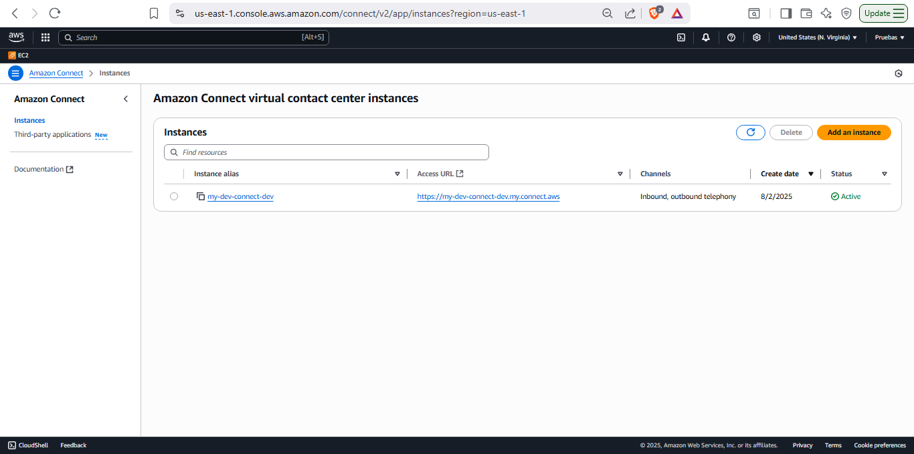
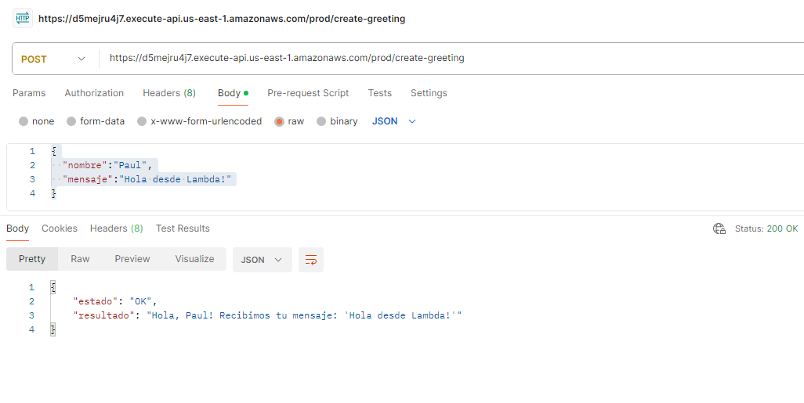
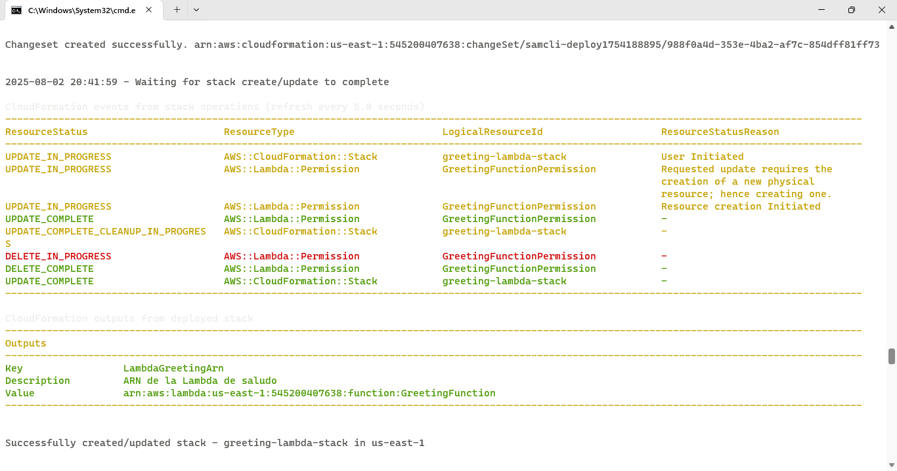

# GreetingFunction - AWS Lambda con API Gateway

Este proyecto implementa un servicio serverless en Java que recibe un nombre y un mensaje, y responde con un saludo personalizado. 
Se expone mediante API Gateway con método `POST`.
Utilizando AWS Connect.



## 🧱 Arquitectura

```plaintext
Postman / Navegador
      ↓
API Gateway (REST)
      ↓
AWS Lambda (Java 21 - Quarkus)
      ↓
Respuesta JSON
```

## 🚀 Endpoint

```
POST /create-greeting
```

- **Cuerpo del request (JSON)**:
```json
{
  "nombre": "Paul",
  "mensaje": "Hola desde Lambda!"
}
```

- **Respuesta esperada**:
```json
{
  "estado": "OK",
  "resultado": "Hola, Paul! Recibimos tu mensaje: 'Hola desde Lambda!'"
}
```

## 🧪 Prueba con Postman

1. URL: `https://d5mejru4j7.execute-api.us-east-1.amazonaws.com/prod/create-greeting`
2. Método: `POST`
3. Headers:  
   - `Content-Type: application/json`
4. Body (raw, JSON):
```json
{
  "nombre": "Paul",
  "mensaje": "Hola desde Lambda!"
}
```


## 🧰 Requisitos

- Java 21
- Maven 3.9+
- Moshi
- AWS CLI configurado
- AWS SAM CLI
- Bucket S3 creado para artefactos (ej. `dev-artifacts-bucket-s3-connect`)

## 🔨 Compilación

```bash
mvn clean package -Pjvm
```

## 📦 Despliegue en BASH

```bash
set PYTHONIOENCODING=utf-8
sam deploy --config-env default
sam deploy --template-file template-connect.yaml --stack-name amazon-connect-iac-dev --region us-east-1 --capabilities CAPABILITY_IAM --s3-bucket dev-artifacts-bucket-s3-connect
sam deploy --template-file template-sam.yaml --stack-name greeting-lambda-stack --capabilities CAPABILITY_IAM --region us-east-1 --s3-bucket dev-artifacts-bucket-s3-connect

```
### 🔧 `template-connect.yml`
-------------------------------------------------------------------------------------------------------------------------------------------------
Outputs
-------------------------------------------------------------------------------------------------------------------------------------------------
Key                 LambdaGreetingArn
Description         ARN de la Lambda de saludo
Value               arn:aws:lambda:us-east-1:545200407638:function:GreetingFunction
-------------------------------------------------------------------------------------------------------------------------------------------------



### 🚀 `template-sam.yml`
- Despliega el API Gateway
-------------------------------------------------------------------------------------------------------------------------------------------------
Outputs
-------------------------------------------------------------------------------------------------------------------------------------------------
Key                 ApiUrl
Description         API Gateway endpoint URL
Value               https://d5mejru4j7.execute-api.us-east-1.amazonaws.com/prod/create-greeting

Key                 LambdaGreetingArn
Description         ARN de la Lambda de saludo
Value               arn:aws:lambda:us-east-1:545200407638:function:GreetingFunction
-------------------------------------------------------------------------------------------------------------------------------------------------


## 📁 Estructura del proyecto

```
.
├── src/main/java/com/connect/
│   ├── GreetingHandler.java
│   └── GreetingRequest.java
│   └── GreetingResponse.java
├── template-sam.yaml
├── README.md
└── ...
```

## 📘 Notas

- Se utiliza el modo `AWS_PROXY` (integración directa entre API Gateway y Lambda).
- La respuesta de Lambda debe incluir `statusCode`, `headers`, y `body` como string JSON.

---

### 🧠 Amazon Connect

- Se puede probar ejecutando `https://my-dev-connect-dev.my.connect.aws`.

---

### ✍️ Autor
© 2025 - Desarrollado por **Paul Rivera**. AWS Certified Solutions Architect - Associate
